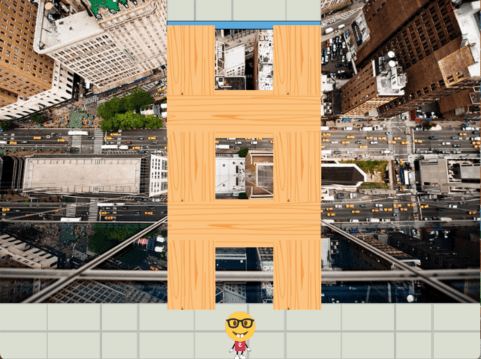
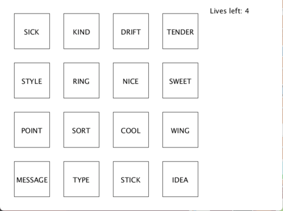

# Escape The New York Times 
### Created by Ethan Fung & Justin Mui

## Objective Of The Game
**Escape the New York Times** is a timed adventure/puzzle game where you, the biggest New York Times (NYT) nerd, have to escape the NYT office building after making the claim to your boss, the CEO, that the puzzles are so easy "they could be solved by a child". Enraged by your claims, the CEO has prepared 3 of the hardest puzzles known to man. Fail even once and you **WILL** be forced to work for the New York Times  **FOREVER**. Do you think you have what it takes to solve these puzzles and defeat the CEO once and for all? 

## Gameplay Mechanics & User Interactions
Within the game, the user will have to interact with the map to access puzzles and move through the game. This includes walking to the elevators and interacting with the desk to play certain puzzles.

The first puzzle is a broken bridge game. There are 3 pairs of wooden planks placed next to each other. In each pair of wooden planks, one is safe to step on, and the other plunges you to your death, sending you back to the start.

The second puzzle is the classic New York Times game, Wordle. Here you will have six attempts to guess a five-letter word. Feedback will be given for each guess, with the colour of the tile indicating when letters match or occupy the correct position. A green tile 🟩 indicates that the letter is correct and in the correct position, yellow 🟨 means it is in the answer but not in the right position, and gray ⬜ indicates that the letter is not in the word at all.

The third and final game is the classic New York Times game, Connections. The goal of the game is to divide a grid of sixteeen words into four gruops of four such that the words in each group belong to a specific categroy (Eg, green, red, blue, yellow, for the category "Colours"). When a group is found, the category is revealed and the words will no longer be selectable. The categories range from easy to extremely hard. The game is won once all four groups are found.

## Speedrun Timer (Scoring)
The game features a timer system for speedrunning/scoring purposes. While it doesn't impact any gameplay, it allows for a more competitive environment with players trying to beat each others' or their own best times.

## Limitations 

## Screenshots Of The Game

### Broken Bridge Game

### Connections Game
